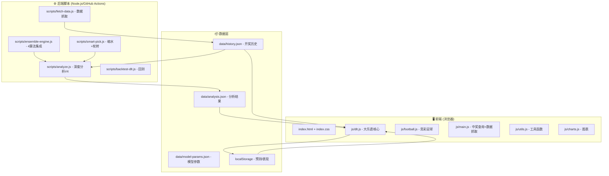

# 体彩深度分析系统 — 进化知识库

## 一、系统架构总览



---

## 二、预测→对比→进化 完整数据流

### 2.1 数据采集

| 来源 | 方式 | 文件 |
|------|------|------|
| 大乐透开奖 | GitHub Actions定时 / 前端API抓取 | `data/history.json` |
| 竞彩足球 | API + 赔率采集 | `data/matches.json` |

### 2.2 预测生成

```
前端: generatePredictionSet() OR 后端: scripts/analyze.js
  ↓
5个策略 × 3种投注方式:
  ├── 单式 5+2 (pickFrontForStrategy + pickBackForStrategy)
  ├── 复式 N+M (pickCompoundFront + pickCompoundBack, 用户可配6-12+2-6)
  └── 胆拖 (pickDantuoPicks: 最高分→胆码, 次高分→拖码)
  ↓
存档: localStorage["dlt_predictions"]
```

**5个策略权重：**

| 策略 | wFreq | wMiss | wRecent | wZone | wTail | 特点 |
|------|-------|-------|---------|-------|-------|------|
| 🎯 自适应 | 0.40 | 0.15 | 0.25 | 0.10 | 0.10 | 动态融合最优策略 |
| 📊 模式匹配 | 0.20 | 0.15 | 0.25 | 0.15 | 0.25 | 偏重区间+尾数 |
| 🔥 热号趋势 | 0.55 | 0.05 | 0.30 | 0.05 | 0.05 | 偏重频率+近期 |
| ⚖️ 均衡推荐 | 0.30 | 0.25 | 0.25 | 0.10 | 0.10 | 各维平衡 |
| 🎲 随机基准 | — | — | — | — | — | 对照组 |

### 2.3 评分公式

```
score(号码i) = wFreq × freq_norm(i) 
             + wMiss × miss_norm(i) 
             + wRecent × recent_10期(i)/10
             + random_noise(0~0.15)
```

约束过滤: 和值65-125, 奇偶2:3或3:2, 跨度≥12

### 2.4 开奖对比

```
comparePredictions():
  ├── 单式: frontHits + backHits → calcHitLevel(7级)
  ├── 复式: C(cFHits,hf) × C(余,5-hf) × ... → winBets + bestLevel
  └── 胆拖: allDanOk? → calcHitLevel(maxF, maxB)
```

### 2.5 策略表现追踪

```js
strategyPerf = {
  "adaptive": {
    total: 12.5,           // 衰减累计预测次数
    totalFrontHits: 18.3,  // 衰减累计前区命中
    totalBackHits: 6.1,    // 衰减累计后区命中
    bestFront: 3,          // 历史最佳前区命中
    bestBack: 1,           // 历史最佳后区命中
    compBestLevel: "七等奖", // 复式最佳奖级
    compTotalWins: 5,      // 复式累计中奖注数
    dtBestLevel: "未中奖"   // 胆拖最佳奖级
  }, ...
}
```

**衰减机制**: 每次对比前 `oldValue *= 0.95`，新数据权重更大

### 2.6 权重进化

```
getAdaptiveWeights():
  1. 从 pattern/hot/balanced 中选 total≥3 且得分最高的
  2. 得分 = avgFrontHits + avgBackHits × 2 (后区命中加权)
  3. 最优策略权重 × 0.8 + 0.05 基础 → 归一化
  4. 输出融合后的 {wFreq, wMiss, wRecent}
```

---

## 三、算法引擎层

### 3.1 集成引擎 (ensemble-engine.js)

| 算法 | 原理 | 权重 |
|------|------|------|
| 多窗口频率 | 5/20/100期分别统计频次 | 0.3 |
| 间隔-遗漏 | 当前遗漏期数的归一化得分 | 0.25 |
| 马尔可夫链 | 一阶转移概率(号码i→号码j) | 0.25 |
| 贝叶斯 | 先验(历史频率)+似然(近期出现) | 0.2 |

### 3.2 智能缩水 (smart-pick.js)

```
35个号码 → 集成评分 → 排除最低8个 → 27个候选
  → AC值过滤 → 三区比/奇偶/和值/连号约束
  → 精选5-8注 或 覆盖20-30注
```

### 3.3 回测系统 (backtest-dlt.js)

- 82期历史回测，逐期滑动窗口
- 评估指标: 前区平均命中、后区平均命中、中奖率
- 策略排名: adaptive > pattern > hot > balanced > cold

---

## 四、数据存储架构

```
data/
├── history.json         ← 104期开奖数据 (GitHub Actions自动更新)
├── analysis.json        ← 分析结果 + 预测记录 (后端生成)
├── model-params.json    ← 模型参数 (区间目标/尾数分布)
├── backtest-report.json ← 回测报告
└── fb-picks/            ← 竞彩推荐存档

localStorage:
├── dlt_predictions      ← 前端预测存档 (最多50期)
├── dlt_strategy_perf    ← 策略表现追踪
└── dlt_history          ← 前端开奖缓存
```

---

## 五、进化路线图

### 🔥 P0 — 立即可做

| 改进 | 说明 | 状态 |
|------|------|------|
| 复式覆盖率纳入权重进化 | getAdaptiveWeights 使用 compTotalWins 调整 | 待做 |
| 胆码命中率影响选胆逻辑 | 历史胆码命中低→减少胆码数 | 待做 |
| 预测次数显示整数 | Math.round(p.total) | ✅已完成 |

### 🟡 P1 — 短期增强

| 改进 | 说明 |
|------|------|
| **多规格对比** | 同时存档6+2、8+4、10+5的预测，对比哪种规格性价比最高 |
| **连号/同尾检测** | 预测选号时评估连号覆盖率和同尾分布 |
| **策略淘汰机制** | 连续N期表现最差的策略自动替换为新随机权重组合 |
| **图表进化可视化** | 策略表现的折线图，直观展示进化趋势 |

### 🟢 P2 — 中期深化

| 改进 | 说明 |
|------|------|
| **贝叶斯超参优化** | 根据历史回测自动调整集成引擎各算法权重 |
| **时序模式识别** | LSTM/Transformer模型检测号码出现的周期性模式 |
| **多期关联分析** | 分析相邻期号码的关联性 |
| **号码温度热力图** | 可视化每个号码的"温度"变化曲线 |

### 🔵 P3 — 长期愿景

| 改进 | 说明 |
|------|------|
| **A/B测试框架** | 自动分流不同算法版本，统计显著性检验 |
| **遗传算法优化权重** | 模拟进化过程，交叉变异产生更优权重组合 |
| **外部数据融合** | 天气、节假日、历史同期等因素关联分析 |
| **蒙特卡洛模拟** | 大规模模拟验证各投注策略的长期收益率 |

---

## 六、关键指标定义

| 指标 | 公式 | 用途 |
|------|------|------|
| 前区命中率 | totalFrontHits / total | 策略核心评价 |
| 后区命中率 | totalBackHits / total | 策略辅助评价 |
| 综合得分 | avgF + avgB × 2 | 进化选择依据 |
| 衰减系数 | 0.95^n | 近期数据更重要 |
| 复式覆盖率 | winBets / totalBets | 复式方案质量 |
| 胆码命中率 | danHits / danTotal | 胆拖方案质量 |
| 期望回报率 | Σ(prob × prize) / cost | 投注价值评估 |
